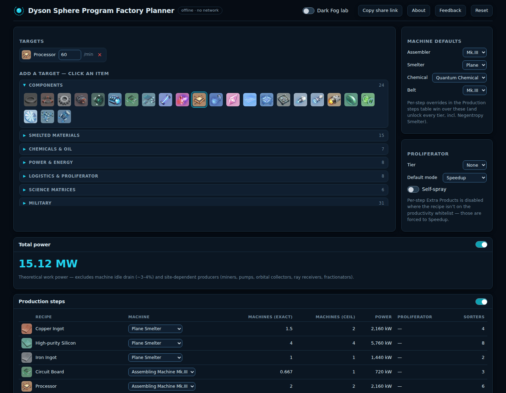

  

  # Dyson Sphere Program Factory Planner

  Pick a target item and rate. Get the full production chain — machines, belts, sorters, power — instantly.

  

  

 

  
  A populated plan: target rate, full production tree, machine counts, and power draw, all in one screen.

## Features

<table>
<tr>
<td width="64"></td>
<td><b>Target picker with per-minute rates</b> Search or browse items, set an exact rate, plan several targets at once.</td>
</tr>
<tr>
<td></td>
<td><b>Full production tree</b> Every intermediate step down to raw resources, with exact and rounded-up (ceiling) machine counts, plus belts and sorters.</td>
</tr>
<tr>
<td></td>
<td><b>Recipe alternatives &amp; per-step overrides</b> Swap alternate recipes and machine tiers anywhere in the tree without recomputing everything by hand.</td>
</tr>
<tr>
<td></td>
<td><b>Proliferator planning</b> Model speedup vs. extra-product spraying, including the proliferator spray cost itself.</td>
</tr>
<tr>
<td></td>
<td><b>Power totals</b> Live power draw for the whole plan as you tune it.</td>
</tr>
<tr>
<td></td>
<td><b>Shareable plan links</b> Every plan is encoded into the URL — send a link, not a screenshot.</td>
</tr>
</table>

Works fully offline once loaded, no account, no install — it's a single HTML file.

## Known limitations

- Power totals are **work power only** — idle/standby drain isn't modeled.
- Fractionator deuterium is treated as a raw import, not derived from hydrogen fractionation.
- Built against game version **0.10.29.21950**; later game updates may shift recipes or numbers.

## Feedback

Found a bug or have a suggestion? [Open an issue](https://github.com/boeloep/DSP-Factory-Planner/issues).

---

Unofficial fan-made tool — not affiliated with or endorsed by Youthcat Studio or Gamera Games.
